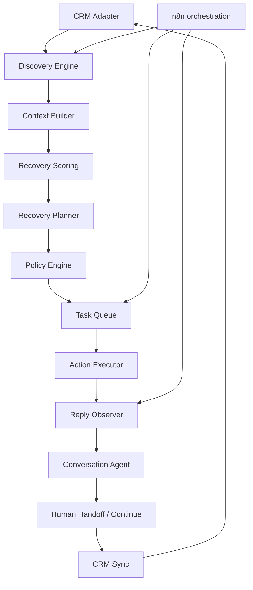

# Oplera

**Autonomous Revenue Recovery Agent**

> Oplera finds revenue already sitting inside your sales pipeline and works to recover it.
>
> A Oplera encontra receita que já entrou no pipeline comercial e trabalha para recuperá-la.

A Oplera não é um CRM, um AI SDR genérico ou uma ferramenta de geração de leads. Ela usa o CRM existente como contexto e sistema de registro para descobrir oportunidades paradas ou perdidas que ainda podem fechar, decidir como recuperá-las, executar ações permitidas por políticas comerciais, interpretar respostas e transferir situações qualificadas para humanos.

## Problema

Empresas já pagaram para gerar, qualificar e trabalhar oportunidades que depois ficaram paradas por proposta sem follow-up, timing, orçamento, abandono do vendedor ou falta de próximo passo. CRMs registram esse pipeline, mas não o operam autonomamente.

A categoria da Oplera é **Revenue Recovery Agent**: AI SDR cria pipeline novo; Oplera recupera pipeline pelo qual a empresa já pagou.

## O que a V0.4 demonstra

A V0.4 prova o ciclo:

```text
discover
→ score
→ plan
→ policy
→ schedule/execute
→ observe reply
→ conversation
→ handoff or continue
→ audit
→ CRM state
```

A Operator Console possui apenas seis áreas: Overview, Recovery Queue, Opportunities, Conversations, Policies e Activity. Fechar o navegador não interrompe o agente; execução e endpoints de orquestração vivem no servidor.

## Arquitetura



A lógica crítica fica em `api/autonomy/`; o n8n orquestra os passos, mas não esconde regras de negócio em nodes gigantes.

## Autonomy model

Toda ação externa segue:

```text
reason → propose → policy → execute → observe → audit
```

A IA pode propor uma ação. O Policy Engine determinístico decide se ela é permitida. Somente o executor pode produzir side effects por uma provider abstraction. Chain-of-thought não é persistido.

## WhatsApp service window

A V0.4 reutiliza a implementação V0.1.1 `resolveServiceWindow()` como única fonte de verdade para a janela de atendimento de 24 horas calculada a partir do último inbound válido.

- dentro de 24h, free-form pode seguir para os demais gates;
- fora de 24h, free-form não executa;
- um `approved_template` só pode executar fora da janela quando o provider declarar explicitamente suporte ao mecanismo permitido;
- sem evidência suficiente, a ação exige revisão/aprovação.

Não existe uma segunda implementação dessa regra na V0.4.

## Recovery Score V0.4

O score é híbrido e reproduzível. Fatores determinísticos incluem valor, inatividade, engajamento prévio, proposta enviada, pergunta explícita de compra, objeção conhecida, seller drop, motivo de perda, opt-out e conversa humana ativa. Uma contribuição semântica opcional é limitada a `-5..+5`; o modelo não controla o score final.

Detalhes: [`docs/recovery-score.md`](docs/recovery-score.md).

## Providers

Interfaces explícitas:

- `CRMProvider`
- `MessagingProvider`
- `CalendarProvider`
- `AIProvider`

O repositório inclui `DemoCRMProvider`, `DemoMessagingProvider`, `DemoCalendarProvider` e `DeterministicAIProvider`. Sem credenciais externas, todo o ciclo continua demonstrável em Demo Mode. Nenhuma credencial é hardcoded.

## Demo Mode

O dataset fictício contém oito cenários:

1. proposal ghosted;
2. lost due to timing;
3. seller dropped;
4. budget objection;
5. opt-out;
6. active human conversation;
7. recovered opportunity;
8. opportunity requiring handoff.

Abra `http://localhost:3001/demo` para a Operator Console ou use a MCP tool `operate_revenue_recovery`.

## Quick start

Requer Bun 1.3+.

```bash
bun install
bun run build
bun run dev:api
```

Endpoints locais:

- MCP: `http://localhost:3001/api/mcp`
- Operator Console demo: `http://localhost:3001/demo`
- snapshot: `GET http://localhost:3001/api/v0.4/operator-console`
- dispatcher demo: `POST http://localhost:3001/api/v0.4/dispatch`
- incoming reply demo: `POST http://localhost:3001/api/v0.4/replies`
- n8n step bridge: `POST http://localhost:3001/api/v0.4/agent-step`
- health: `http://localhost:3001/health`

A tool V0.1.1 `analyze_revenue_recovery` foi preservada e adaptada para a Operator Console V0.4. A tool `operate_revenue_recovery` abre o snapshot completo da V0.4.

## n8n

Os nove workflows ficam em [`n8n/workflows`](n8n/workflows) e são mantidos como JSON versionado. Configure `OPLERA_BASE_URL` no n8n e importe os arquivos. O setup está em [`docs/n8n-setup.md`](docs/n8n-setup.md).

## Policy model

Contact policy controla tentativas, intervalo mínimo, horas/dias permitidos, opt-out e conversa humana ativa. Commercial policy controla preço, desconto e propostas customizadas. Handoff policy impede autonomia em jurídico/contrato, reclamação, customização desconhecida, alta intenção e evidência insuficiente.

Veja [`docs/policy-engine.md`](docs/policy-engine.md).

## Segurança

- schemas Zod para entradas/structured state;
- secrets somente por ambiente/provider configuration;
- nenhum secret no frontend ou workflows exportados;
- idempotency keys em ações externas;
- opt-out e suppression antes do side effect;
- WhatsApp service window como policy gate;
- audit trail factual sem chain-of-thought;
- providers de demo não fazem chamadas externas reais;
- mensagens e ações não podem inventar preço, desconto, contrato, prazo ou funcionalidades.

Detalhes: [`docs/security.md`](docs/security.md).

## Limites reais da V0.4

O repositório atual não possui PostgreSQL. Portanto a fila da Demo V0.4 é uma implementação em memória com leasing/idempotência para provar a semântica. Uma fila PostgreSQL durável com `FOR UPDATE SKIP LOCKED` é o caminho documentado para produção, mas não foi adicionada artificialmente a este MVP. Também não há CRM, WhatsApp ou calendar provider real configurado, nem execução com LLM real por padrão.

A WhatsApp Cloud API não é uma API de exportação retroativa de todo histórico. Conversas históricas continuam entrando por CRM/export autorizado; novas respostas podem entrar por webhook/provider quando uma integração real for contratada.

## Qualidade

```bash
bun install --frozen-lockfile
bun run ci:check
bun run check
bun run test
bun run build
```

Os testes cobrem scoring, policy gates, boundaries da janela de 24h, leasing/retry/idempotência, conversation agent, handoff e lifecycle demo.

## Documentação

- [`docs/architecture.md`](docs/architecture.md)
- [`docs/recovery-model.md`](docs/recovery-model.md)
- [`docs/recovery-score.md`](docs/recovery-score.md)
- [`docs/policy-engine.md`](docs/policy-engine.md)
- [`docs/agent-lifecycle.md`](docs/agent-lifecycle.md)
- [`docs/n8n-setup.md`](docs/n8n-setup.md)
- [`docs/demo-scenarios.md`](docs/demo-scenarios.md)
- [`docs/security.md`](docs/security.md)

## Open-source inspirations

Conceitos arquiteturais foram estudados em:

- Comp AI CRM: agentic-first architecture, work queue, `dueAt`, task leasing, schedule reason, execution budget e UI operacional;
- DeskcommCRM: IA como operador, AI → human handoff, conversation state, policy/governance e audit trail;
- CRM AI Agent: scoring, pending actions, human approval e decision logs.

A implementação V0.4 desses conceitos é própria. Nenhum bloco de código desses três projetos foi copiado. Consulte [`THIRD_PARTY_NOTICES.md`](THIRD_PARTY_NOTICES.md).
